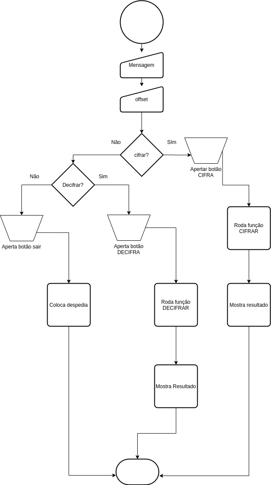
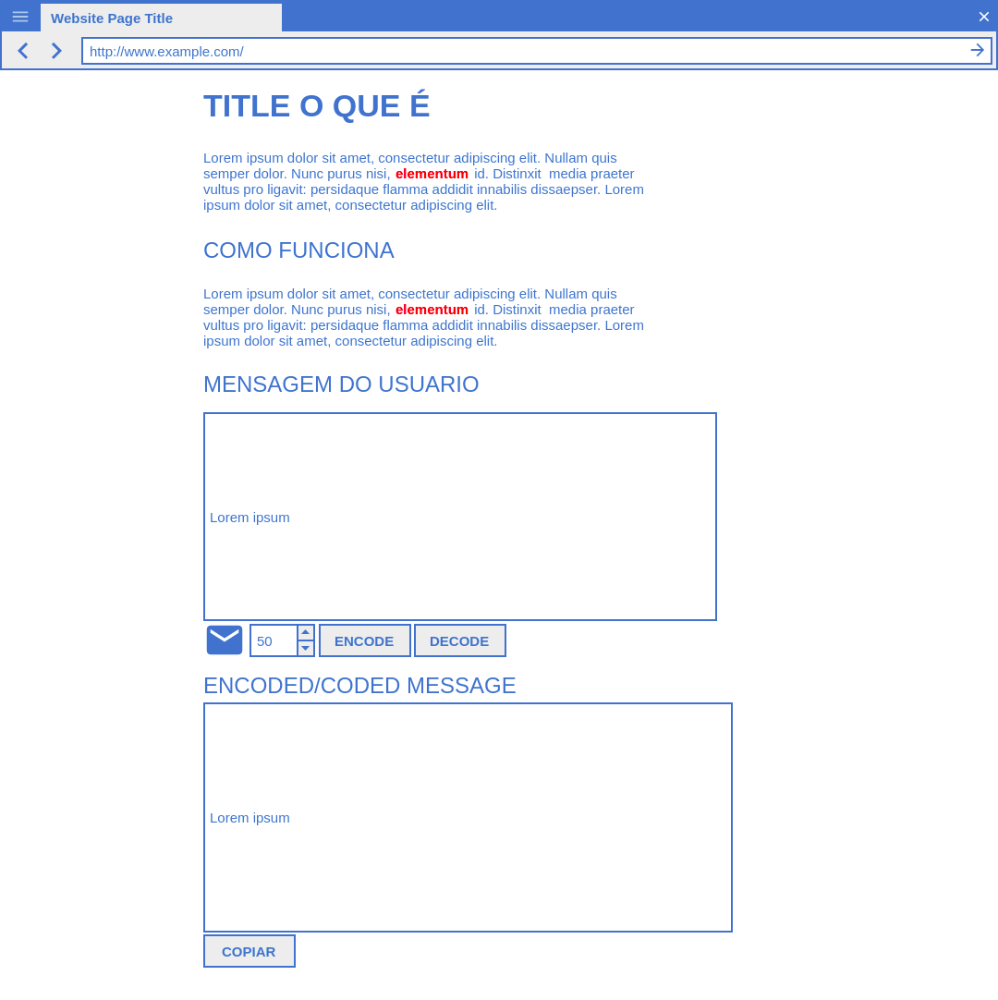

# Cifra de César

## 1. Processo de decisões do desenho:
* Definição de provável usuário. 
* Definição de principal problema do usuário e solução.
* Realizado fluxograma geral da aplicação.
* Utilizada ferramenta pencil para criar um esboço da interface da aplicação.

### 1.1 Indentificação do usuario:
Destinado a jornalistas e suas fontes para cifragem e decifragem de textos.

### 1.2 Indentificação do problema e solução:
O problema, seria a interceptação do texto do usuário e vizualização de seu conteúdo.
A solução seria a cifragem desse conteúdo com uma chave de offset escolhida pelo usuário, e a decifragem seria realizada pelo seu contato utilizando a chave escolhida.

### 1.3 Realização de fluxograma geral da aplicação:
Foi definido o fluxograma pensando na experiência do usuário, conforme imagem abaixo:

### 1.4 Definição de Wireframe:
Define-se wireframe como um esqueleto, um protótipo ou uma versão bastante primitiva do visual de um projeto.
Nesse projeto o Wireframe foi definido, pensando na experiencia do usuario conforme esboço abaixo, realizado na ferramente ***Pencil***

## 2.CHECKLIST
* [x] `README.md` adicionar informação sobre o processo e decisões do desenho.
* [x] `README.md` explicar claramente quem são os usuários e as suas relações com o produto.
* [x] `README.md` explicar claramente como o produto soluciona osproblemas/necessidades dos usuários.
* [ ] `README.md` explicar claramente como o pode ser feito deploy e instalação.
* [ ] Usar VanillaJS.
* [x] **Não** usar `this`.
* [ ] Implementar `cipher.encode`.
* [ ] Implementar `cipher.decode`.
* [ ] Passar o linter com a configuração definida.
* [ ] Passar as provas unitárias.
* [ ] Testes unitários cubrindo 70% dos _statements_, _functions_ e _lines_, e
  no mínimo 50% das _branches_.
* [x] Interface que permita escolher o `offset` (chave de deslocamento) usava
  para cifrar/decifrar.
* [x] Interface que permita escrever um texto para ser cifrado.
* [x] Interface que mostre o resultado da cifra corretamente.
* [x] Interface que permita escrever um texto para ser decifrado.
* [x] Interface que mostre o resultado decifrado corretamente.

### Parte Opcional: "Hacker edition"

* [ ] Cifrar/decifrar minúsculas.
* [ ] Cifrar/decifrar _outros_ caractéres (espações, pontuação, `ç`, `á`, ...).
* [ ] Permitir usar `offset` negativo.

<!-- ctrl+shift+v pré vizualizar -->